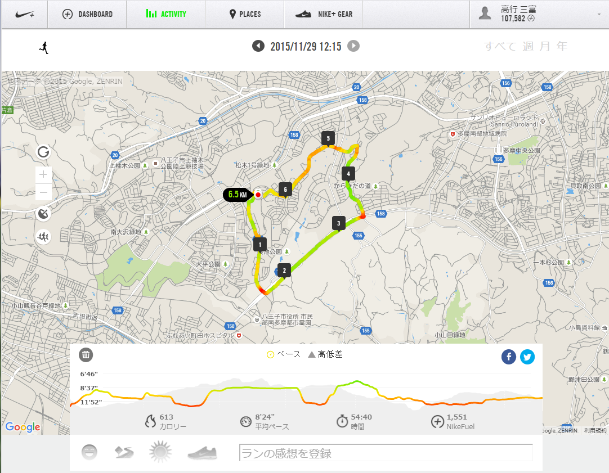

# 事務マニュアル
## 休日出勤について
前日の昼までに上長と相談うえ、社長へ個別に申請します。

**休日出勤時のタイムカードの打刻漏れ**には特に気を付けてください。最悪、認められないケースも発生するので、慎重に対応をお願いします。

## 経費の精算について
主な経費の内訳は次の通りです。
- 資料代
- 通信費
- 消耗品費

|概要 |内容 
|--|--
|資料代 |資料本 資料アプリ
|通信費 |切手 宅急便代
|消耗品費 |文具 台所用品

## 宅配便の発送について
## 電話、来客対応について
## ゴミ取集について
## プリンタについて
## 大容量データの送受信について